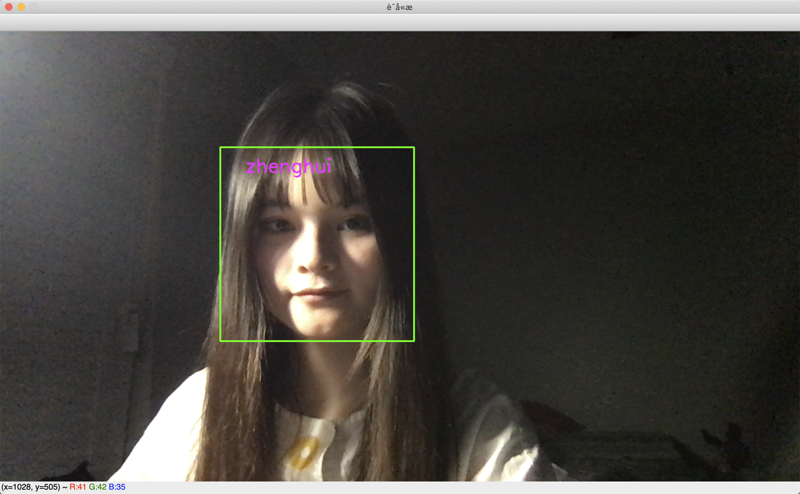
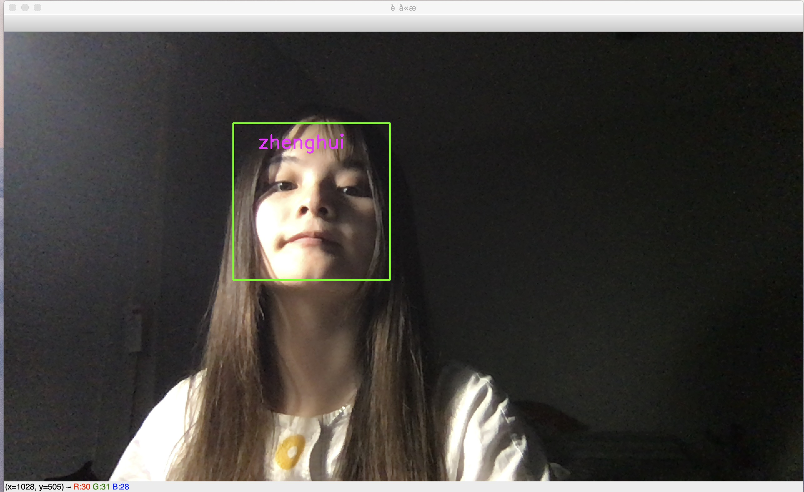

# Class_636_Project

:smile: Welcome to my **Person Dectecion** project.

For the recent years, person identification/detection, as a branch of Objection Detection, became a heated issue. It contains many parts of topics, such as face recognition, human pose estimation, human segmentation ect. My project mainly focused on face detection of that part.

Deep into my task, it mainly involves two part: recognize where is a face and detect who is the face. While lots of great open sources reached a high performance, I get relative precise range of human face with the help of OpenCV, an mature open resource. The model was mainly built for recognize people who is it. Building my own model, I also want to do something on my own. Finally, I decided to build my personal face detection system.

# Getting Started

## Prerequisites
- Python 3
-	Tensorflow
-	Keras
-	sys
-	Cv2
-	Numpy
-	Tkinter

## Collect Dataset
:running:Run
```
python catchpic.py
```
**The camera will started collect data. Then output [a bunch of unknown face](https://github.com/ZhenghuiWan/Class_636_Project/tree/master/data/zhenghui). I labeled it as my name help training.**

## Train model
:running:Run:
```
python face_train.py
```
**Load dataset from the the folder [data](/data)**

Model Result

*Training:*

*Epoch 1/10
958/958 [==============================] - 208s 217ms/step - loss: 0.5552 - acc: 0.9234 - val_loss: 0.5592 - val_acc: 0.9243*

*Epoch 2/10
958/958 [==============================] - 217s 226ms/step - loss: 0.4275 - acc: 0.9263 - val_loss: 0.4592 - val_acc: 0.9253*

*Epoch 3/10
958/958 [==============================] - 250s 261ms/step - loss: 0.4232 - acc: 0.9338 - val_loss: 0.4592 - val_acc: 0.9362*

*Epoch 4/10
958/958 [==============================] - 289s 301ms/step - loss: 0.4370 - acc: 0.9471 - val_loss: 0.4392 - val_acc: 0.9426*

*Epoch 5/10
958/958 [==============================] - 209s 218ms/step - loss: 0.3300 - acc: 0.9448 - val_loss: 0.3592 - val_acc: 0.9450*

*Epoch 6/10
958/958 [==============================] - 217s 226ms/step - loss: 0.2300 - acc: 0.9579 - val_loss: 0.2592 - val_acc: 0.9543*

*Epoch 7/10
958/958 [==============================] - 218s 228ms/step - loss: 0.1258 - acc: 0.9601 - val_loss: 0.2292 - val_acc: 0.9477*

*Epoch 8/10
958/958 [==============================] - 211s 220ms/step - loss: 0.1266 - acc: 0.9648 - val_loss: 0.1292 - val_acc: 0.9537*

*Epoch 9/10
958/958 [==============================] - 209s 218ms/step - loss: 0.1652 - acc: 0.9675 - val_loss: 0.1692 - val_acc: 0.9563*

Epoch 10/10
958/958 [==============================] - 206s 215ms/step - loss: 0.1521 - acc: 0.9672 - val_loss: 0.1592 - val_acc: 0.9651*

*28746 train samples
12321 valid samples
20534 test samples*

*Testing:
20534/20534 [==============================] - 71s 3ms/step
acc: 96.57% *


## Test result
:running: Run:
```
python reid.py
```



## GUI
:running: Run:
```
cd GUI
python GUI.py
```
:star: See the GUI demo [here](https://youtu.be/D9BKKvXw6rI)

# Finished!
Thank you Professor [Anxiao Jiang](http://faculty.cse.tamu.edu/ajiang/) who has a significant guide towards my project! 

Thank you TA and grader's great effort during the semester!
